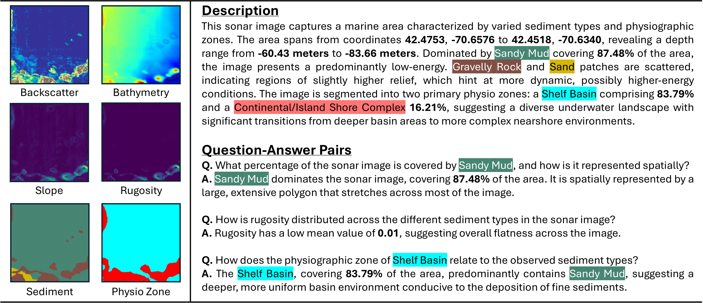
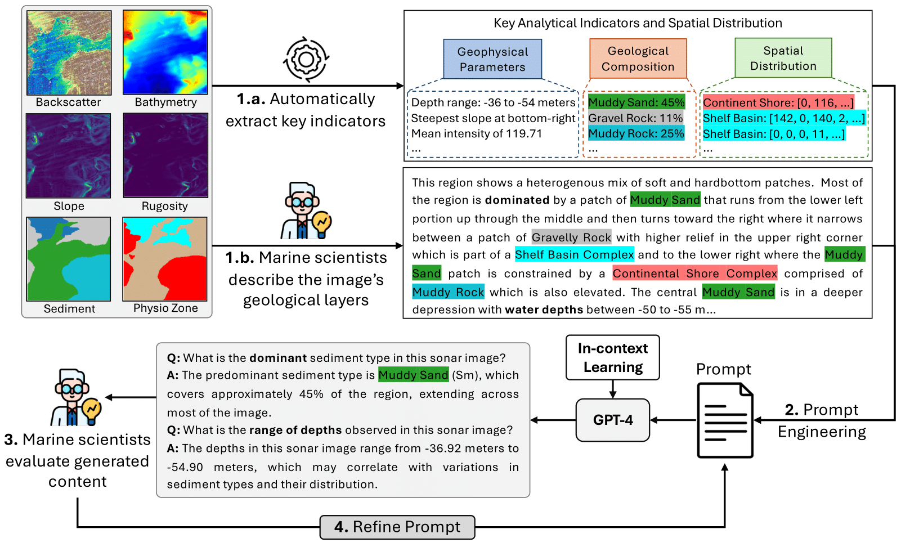

# [NeurIPS'24 D&B] SeafloorAI: A Large-scale Vision-Language Dataset for Seafloor Geological Survey

Paper: [arXiv](https://arxiv.org/abs/2411.00172)

### Abstract
A major obstacle to the advancements of machine learning models in marine science, particularly in sonar imagery analysis, is the scarcity of AI-ready datasets. While there have been efforts to make AI-ready sonar image dataset publicly available, they suffer from limitations in terms of environment setting and scale. To bridge this gap, we introduce ```SeafloorAI```, the first extensive AI-ready datasets for seafloor mapping across 5 geological layers that is curated in collaboration with marine scientists. We further extend the dataset to ```SeafloorGenAI``` by incorporating the language component in order to facilitate the development of both *vision*- and *language*-capable machine learning models for sonar imagery. The dataset consists of 62 geo-distributed data surveys spanning 17,300 square kilometers, with 696K sonar images, 827K annotated segmentation masks, 696K detailed language descriptions and approximately 7M question-answer pairs. By making our data processing source code publicly available, we aim to engage the marine science community to enrich the data pool and inspire the machine learning community to develop more robust models. This collaborative approach will enhance the capabilities and applications of our datasets within both fields.

### Dataset Overview

Overview of the spatially distributed seafloor mapping datasets. The table highlights key dataset statistics. We incorporate 62 public data surveys published by USGS and NOAA from 9 major regions to construct ```SeafloorAI``` and ```SeafloorGenAI``` datasets.

### Geological Attribute Categories
#### Sediment
<p align="left">
  
</p>

#### Physiographic Zone
<p align="left">
  
</p>

#### Habitat
<p align="left">
  
</p>

### Data Sample


### Language Annotation Procedure

Pipeline for generating question-answer pairs for sonar imagery samples using ```GPT-4```: Marine scientists first identify necessary information, followed by the extraction of *geophysical parameters*, *geological composition*, and *spatial distribution*. They then provide descriptions for a handful of samples from the ```SeafloorAI``` dataset. These description are used to design a prompt for ```GPT-4``` to generate high-quality, domain-specific question-answer pairs, via in-context learning.

### Dataset Structure

    SeafloorAI
        |--region1
        |   |--input
        |   |   |--region1_0000056_0000128.npy
        |   |   |__...
        |   |--sed
        |   |   |--region1_0000056_0000128.npy
        |   |   |__...
        |   |--pzone
        |   |   |--region1_0000056_0000128.npy
        |   |   |__...
        ...
        |--region3
        |   |--input
        |   |   |--region3_0000090_0000132.npy
        |   |   |__...
        |   |--habitat
        |   |   |--region3_0000090_0000132.npy
        |   |   |__...
        ...

### Data Processing

As we are finding a reliable way to host our 400GB dataset, we provide the data processing code for now.

We start from the hydrographic data surveys that can be combined into a larger region, such as the ones in the California data repository [link](https://pubs.usgs.gov/ds/781/). The data processing stage contains 4 main steps:

1. **Reprojection** ([code](data_processing/reproject.ipynb)): Reproject the Backscatter and Bathymetry, which are stored in GeoTIFF format to WGS84 (EPSG:4326) Coordinate Reference System.
2. **Resample** ([code](data_processing/resample.ipynb)): Resample Bathymetry to Backscatter's resolution, as Backscatter usually has higher resolution.
3. **Merging** ([code](data_processing/merge.ipynb)): Merge all the Backscatter mosaics from different surveys into one unified raster file. Same procedure applies to Bathymetry. They are merged based on the geo-location pre-defined in the GeoTIFF.
4. **Patchification** ([code](data_processing/create_patches.py)): Use a sliding window of size 224 $\times$ 224 and a step size of 56 to slice the map into smaller patches. We only keep patches whose at lease 90% of the total pixels are valid.
- **Interpolation**: Filling the missing data via standard interpolation techniques for each patch.
- **Smoothing**: Use median filtering to remove speckle noise from the images.

#### TODO

* [ ] Add links to all data surveys
* [ ] Add information on mapping layer categories

#### Citation
    
    @inproceedings{
        nguyen2024seafloorai,   
        title={SeafloorAI: A Large-scale Vision-Language Dataset for Seafloor Geological Survey}, 
        author={Kien X. Nguyen and Fengchun Qiao and Arthur Trembanis and Xi Peng},
        booktitle={Proceedings of the Annual Conference on Neural Information Processing Systems (NeurIPS) Datasets and Benchmarks Track},
        year={2024}

    }